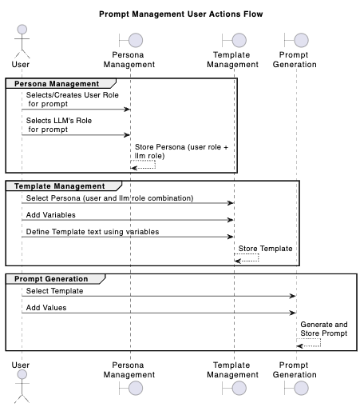

# Promptly


# Promptly

A prompt management application with **persona-based templating** for AI interactions. Create reusable **personas**, **prompt templates** with **variable substitution** for various use cases.
User can play a role and may want LLM to play another role. For example:

- I am a **High School Student** and want LLM to play role of **Patient Teacher**. Some other time same person may want LLM to play a role of **Mock Tester** or **Test Question Generator** or may be a **Student Buddy**. In each scenario, different prompts, appropriate to the role play will yield best results.

## Features



- **Persona Management**: Define user and LLM roles for different contexts
- **Template System**: Create reusable prompt templates with `{{variable}}` placeholders
- **Template Version Management**: Maintain versions of templates and edit them separately. Track generated prompts
- **Prompt Generation**: Generate final prompts by substituting template variables
- **Web Interface**: Modern SvelteKit frontend for easy management
- **REST API**: Full CRUD operations for all entities
- **Storage Options**:
  - **JSON Store**: Simple file-based persistence (default)
  - **SQLite Store**: Database storage with automatic schema initialization
- **Docker Support**: Containerized deployment with ECR integration
- **Production Ready**: EC2 deployment with docker-compose

## Use Case

- **Generic RAG Application**: User adds their artifacts and later wants to query that corpus. However they want to use sophesticated prompts to customize response. Example: A High School student may want to generate Mock Tests for his preparation.
- **Interviewee**: User adds their artifacts and later wants to query that corpus. They want to simulate interview process using LLMs ability to play a role of an interviewer.
- **Pair Programming**: User may want to use LLM for pair programming by asking LLM to play that role.

## Quick Start

### Prerequisites

- Go 1.22+
- Node.js 18+

### Installation

1. Clone the repository:

```bash
git clone https://github.com/rahulguha/promptly.git
cd promptly
```

2. Build the Go backend:

```bash
go build -o promptly cmd/promptly/main.go
```

3. Start the API server:

```bash
./promptly serve
```

4. Set up the web interface (in a new terminal):

```bash
cd promptly-web
npm install
npm run dev
```

The API will be available at `http://localhost:8080` and the web interface at `http://localhost:5173`.

## Usage

### CLI Options

```bash
# Start server on default port 8080 with JSON storage
./promptly serve

# Custom port and data path
./promptly serve --port 3000 --data ./custom-data/prompts.json

# Use SQLite storage
./promptly serve --storage sqlite --db data/promptly.db

# Custom port with SQLite
./promptly serve --port 3000 --storage sqlite --db ./custom-data/app.db

# Help
./promptly --help
```

### Workflow

1. **Create Personas**: Define user roles (e.g., "Developer") and corresponding LLM roles (e.g., "Code Reviewer")
2. **Build Templates**: Create prompt templates linked to personas with variable placeholders like `{{project_name}}`
3. **Generate Prompts**: Substitute variables with actual values to create final prompts

### API Endpoints

- `GET/POST/PUT/DELETE /v1/personas` - Manage user/LLM role definitions
- `GET/POST/PUT/DELETE /v1/templates` - Manage prompt templates
- `GET/POST/PUT/DELETE /v1/prompts` - Manage generated prompts
- `POST /v1/generate-prompt` - Generate prompts from templates
- `GET /health` - Health check

## Development

### Backend

```bash
# Run tests
go test ./...

# Build
go build -o promptly cmd/promptly/main.go
```

### Frontend

```bash
cd promptly-web

# Development server
npm run dev

# Build for production
npm run build

# Preview build
npm run preview
```

## Docker Deployment

### Local Development

1. Build the binary for Docker:

```bash
./docker/build-api-mac.sh
```

2. Build and run with Docker:

```bash
# Build the Docker image
cd docker && docker build -f dockerfile.promptly-api-local -t promptly-api-local .

# Run locally
docker run -p 8082:8082 -v "$(pwd)/data":/app/data promptly-api-local
```

### Production Deployment (EC2)

1. Deploy using docker-compose:

```bash
# On your EC2 instance
sudo mkdir -p /opt/promptly/data
cd /opt/promptly

# Copy docker-compose.yml and configure
wget https://raw.githubusercontent.com/yourusername/promptly/main/docker-compose.yml

# Create production config
echo "port: 8082
data: data/prompts.json" > config.yaml

# Login to ECR (configure AWS CLI first)
aws ecr get-login-password --region us-east-1 | docker login --username AWS --password-stdin your-account.dkr.ecr.us-east-1.amazonaws.com

# Start the service
docker-compose up -d
```

## Configuration

The application looks for configuration in:

- Command line flags (`--port`, `--data`, `--storage`, `--db`)
- Config file (`config.yaml` or `.promptly`)
- Environment variables

### Storage Options

**JSON Storage (default)**:

- Data directory: `data/` (creates `prompts.json`, `prompt_template.json`, `persona.json`)
- Use: `--storage json --data path/to/data.json`

**SQLite Storage**:

- Database file: `data/promptly.db` (auto-created with schema)
- Use: `--storage sqlite --db path/to/database.db`

## Documentation

- [API Documentation](API.md) - Complete REST API reference
- [Examples](examples/) - Usage examples and demo data

## Contributing

See [CONTRIBUTING.md](CONTRIBUTING.md) for guidelines on how to contribute to this project.

## License

Licensed under the Apache License 2.0. See [LICENSE](LICENSE) for details.
