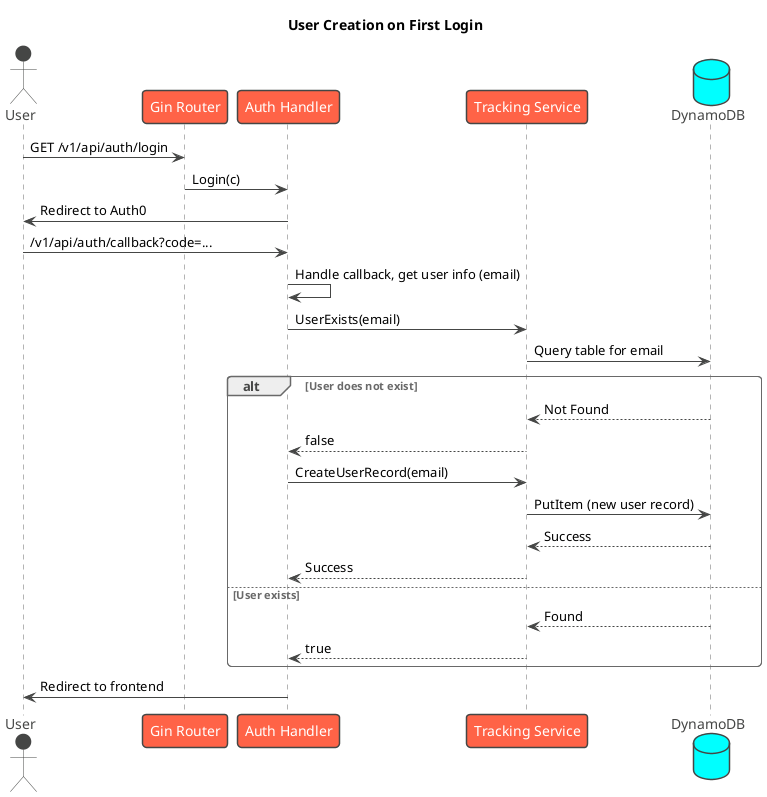

```plantuml
@startuml
!theme vibrant
title User Creation on First Login

actor User
participant "Gin Router" as Router
participant "Auth Handler" as AuthHandler
participant "Tracking Service" as TrackingService
database "DynamoDB" as Dynamo

User -> Router: GET /v1/api/auth/login
Router -> AuthHandler: Login(c)
AuthHandler -> User: Redirect to Auth0

User -> AuthHandler: /v1/api/auth/callback?code=...
AuthHandler -> AuthHandler: Handle callback, get user info (email)
AuthHandler -> TrackingService: UserExists(email)
TrackingService -> Dynamo: Query table for email
alt User does not exist
    TrackingService <-- Dynamo: Not Found
    AuthHandler <-- TrackingService: false
    AuthHandler -> TrackingService: CreateUserRecord(email)
    TrackingService -> Dynamo: PutItem (new user record)
    Dynamo --> TrackingService: Success
    TrackingService --> AuthHandler: Success
else User exists
    TrackingService <-- Dynamo: Found
    AuthHandler <-- TrackingService: true
end
AuthHandler -> User: Redirect to frontend

@enduml
```